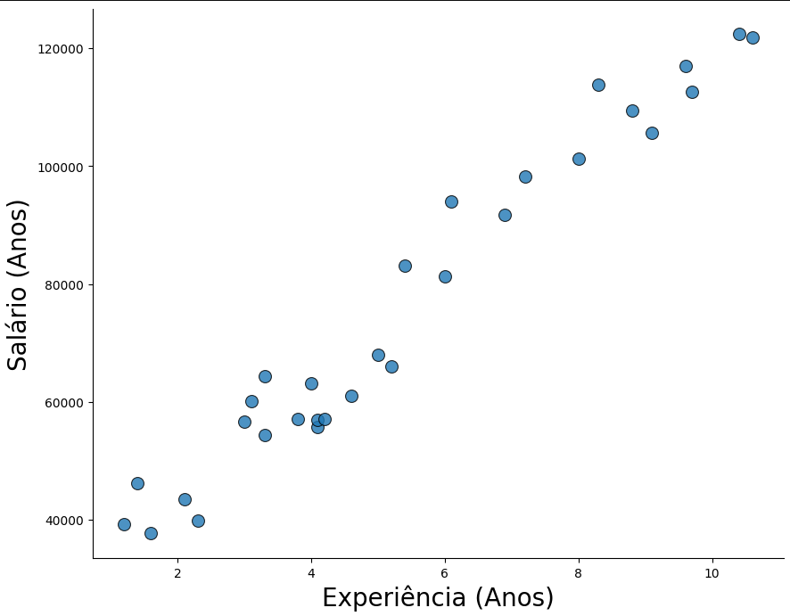
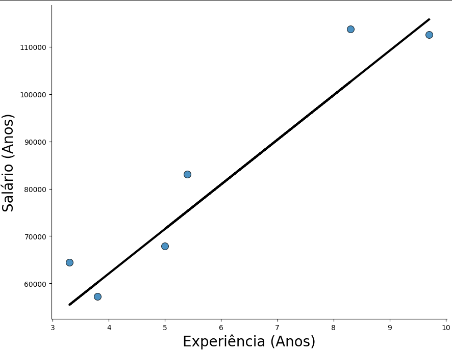

# Projeto: Predição de Salário com Base na Experiência

## Introdução

Este projeto tem como objetivo modelar a relação entre anos de experiência profissional e o salário correspondente, utilizando técnicas de regressão linear. A partir da análise de uma base de dados histórica, foi possível construir um modelo preditivo que permite estimar o salário esperado para diferentes níveis de experiência.

## Análise e Resultados

### Regressão Linear
Foi realizada uma análise de regressão linear simples para modelar a relação entre as variáveis 'anos de experiência' e 'salário'. Os resultados obtidos indicam que [resumo dos resultados da regressão, como coeficiente de determinação (R²), p-valor, etc.].

### Visualização dos Resultados
* **Gráfico de Dispersão:**
  
    [Incluir o scatter plot mostrando a relação entre as variáveis]
* **Gráfico de Dispersão com Reta de Regressão:**
    
    [Incluir o scatter plot com a reta de regressão ajustada]

## Modelo Preditivo
O modelo de regressão linear gerado permite realizar previsões de salário com base em um determinado número de anos de experiência.

## Ambiente de Trabalho
* **Linguagem:** [Python]
* **Bibliotecas:** [NumPy, Pandas, Scikit-learn, Matplotlib, seaborn]
* **Notebook:** [Jupyter Notebook]
